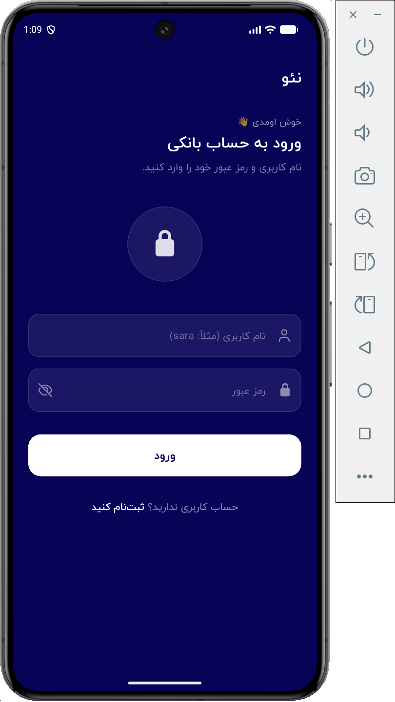
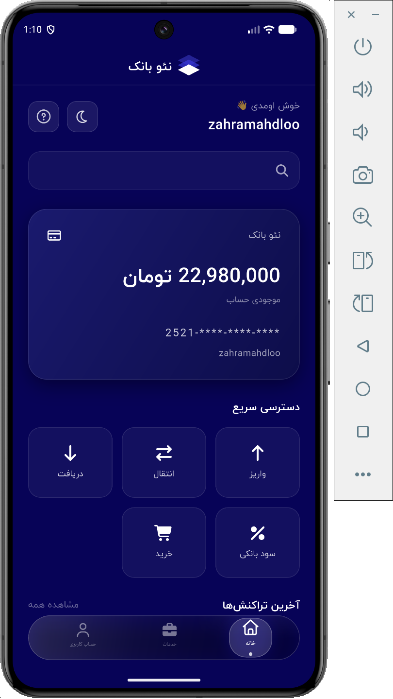
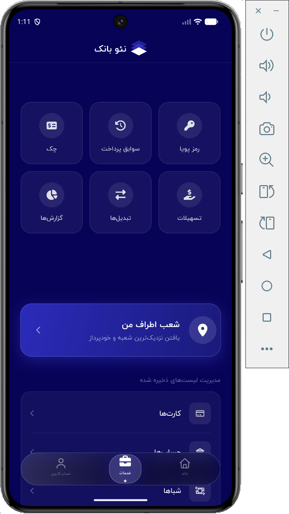

# NeoBank - Flutter Banking App

A modern RTL mobile banking application built with Flutter.

## Overview

NeoBank is a portfolio-ready mobile banking app built with Flutter.
The project focuses on clean UI, Persian RTL support, responsive layouts, theme management, routing, and a scalable feature-based structure.

This project demonstrates practical Flutter development skills such as UI implementation, app architecture, state management, reusable widgets, and preparing a mobile app for public portfolio use.

## Features

* Persian RTL user interface
* Modern mobile banking UI
* Dark and light theme support
* Responsive layout
* Custom animated logo
* Splash screen
* Authentication pages
* Dashboard navigation
* Home screen with balance card and transactions
* Services page
* Profile page
* Clean feature-based folder structure

## Tech Stack

* Flutter
* Dart
* Bloc / Cubit
* GoRouter
* Dio
* Get It
* ScreenUtil
* Material 3

## Project Structure

```txt
lib/
├── core/
│   ├── constants/
│   ├── dependency_injection/
│   ├── error/
│   ├── network/
│   ├── routes/
│   ├── theme/
│   ├── utils/
│   └── widgets/
│
├── features/
│   ├── auth/
│   ├── dashboard/
│   ├── home/
│   ├── profile/
│   ├── services/
│   └── splash/
│
└── main.dart
```

## Screenshots

<p align="center">
  
  
  
</p>


## Local Fonts

This project uses local font files for Persian UI.
Font files are intentionally not included in this public repository.

To run the project locally, add the required font files inside:

```txt
assets/fonts/
```

Required files:

```txt
IRANYekanRegular.ttf
IRANYekanMedium.ttf
IRANYekanBold.ttf
```

## Installation

Clone the repository:

```bash
git clone https://github.com/zahramahdloo/neobank-flutter-app.git
cd neobank-flutter-app
```

Install dependencies:

```bash
flutter pub get
```

Run the app:

```bash
flutter run
```

## Build APK

```bash
flutter build apk --release
```

## What I Learned

* Building RTL Flutter applications
* Creating a scalable project structure
* Managing app theme with Cubit
* Implementing feature-based architecture
* Working with custom widgets
* Preparing a Flutter project for public portfolio use

## Status

This project is under active development.
